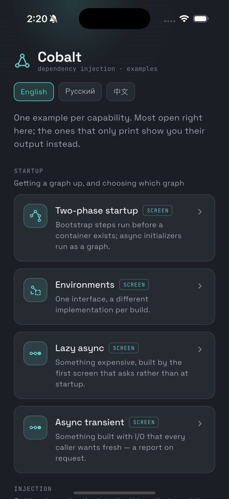
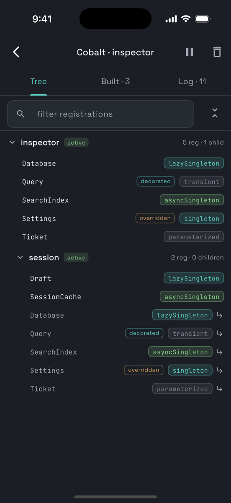
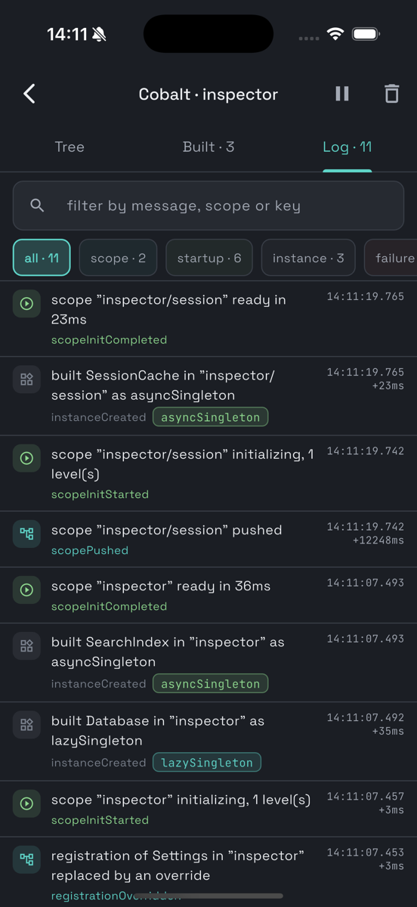
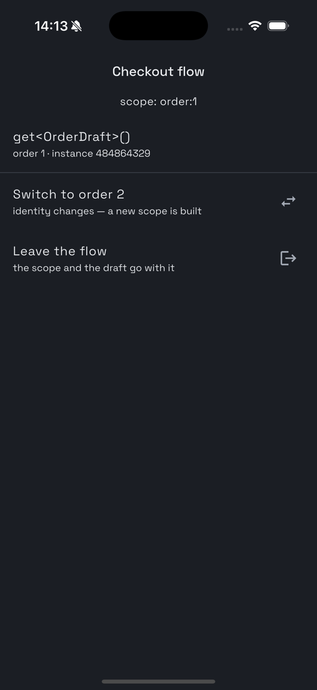
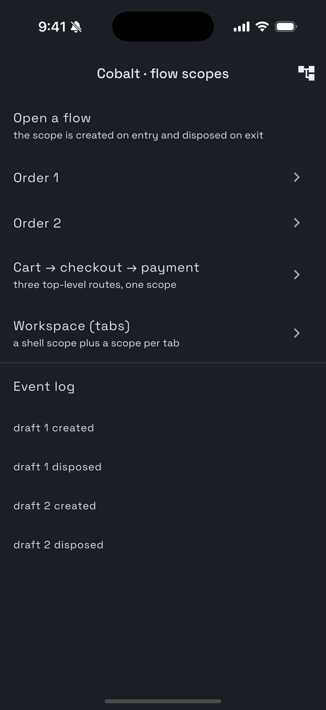
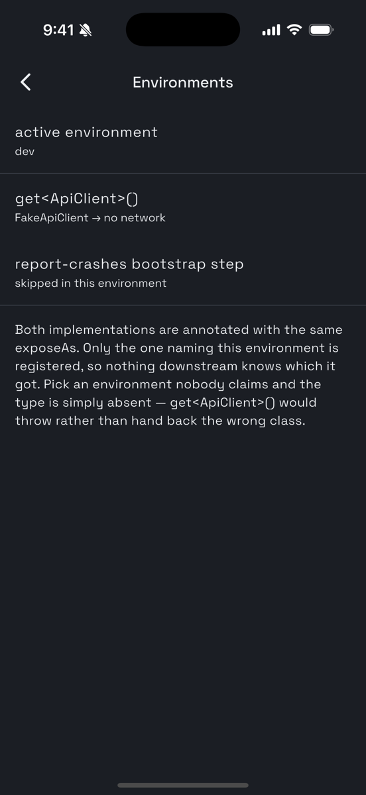

<p align="center">
  
</p>

<p align="center">
  <a href="https://pub.dev/packages/cobalt"></a>
  <a href="https://pub.dev/packages/cobalt/score"></a>
  <a href="https://pub.dev/packages/cobalt"></a>
  <a href="https://github.com/rutikeyone/cobalt/actions/workflows/ci.yml"></a>
  <a href="LICENSE"></a>
</p>

<p align="center">
  <a href="README.md">English</a> · <a href="README.ru.md">Русский</a> · <a href="README.zh-CN.md">中文</a> · <a href="README.ko.md">한국어</a>
</p>

> 이 문서는 [README.md](README.md)를 번역한 것입니다. 영어판이 기준이며, 내용이 다르면 영어판을 따릅니다.
> 각 패키지의 README는 번역하지 않습니다. 해당 문서는 API 레퍼런스입니다.

# Cobalt

Dart와 Flutter를 위한 의존성 주입 프레임워크입니다. 두 가지 모드를 지원합니다. 선언적 코드 생성과,
같은 런타임 위에서 동작하는 순수 Dart 수동 API입니다.

상태: **1단계 완료.** 런타임, Flutter 바인딩, 어노테이션, 분석 계층, 두 제너레이터와 린트 플러그인이
모두 구현되고 테스트되었습니다.

| | |
|---|---|
| **코드 생성 없이 사용하기** | [GUIDE_MANUAL.ko.md](GUIDE_MANUAL.ko.md): 등록은 직접 작성합니다 |
| **제너레이터와 함께 사용하기** | [GUIDE_CODEGEN.ko.md](GUIDE_CODEGEN.ko.md): 어노테이션, 그리고 빌드 시점에 검사되는 그래프 |
| **`get_it` 또는 `injectable`에서 옮겨 오는 경우** | [MIGRATION.ko.md](MIGRATION.ko.md): 무엇이 대응되고 무엇이 대응되지 않는지 |
| **실행해 보기** | `cd examples/gallery && flutter run` |

<p align="center">
  
  
  
</p>

<p align="center"><sub>예제 갤러리, 모든 등록의 수명이 표시되는 실시간 스코프 트리, 그리고 그래프가 보고한 모든 것: 실행 중인 앱 안의 <code>cobalt_inspector</code>입니다.</sub></p>

<p align="center">
  
  
  
</p>

<p align="center"><sub>스코프를 소유하는 결제 플로우: 초안은 플로우 안에서 화면을 이동해도 살아남고 플로우가 끝나면 함께 사라집니다. 그리고 어떤 구현을 등록할지 자체를 고르는 환경입니다.</sub></p>

## 개요

자신이 빌드한 것을 소유하는 컨테이너입니다. 스코프는 스택이 아니라 트리를 이루므로, 세션, 결제 플로우,
화면이 각자 자신의 수명을 가지며, 하나를 끝내면 그 안에서 빌드된 모든 것도 함께 끝납니다.
로그아웃은 `await scope.dispose()` 한 줄이며, 세션 스트림 구독 아홉 개와 도메인 인터페이스에
새어 들어간 `reset()` 메서드 네 개가 아닙니다.

코드 생성은 이 런타임 위의 편의 기능일 뿐, 두 번째 프레임워크가 아닙니다. 제너레이터는 여러분이 직접
작성했을 코드를 그대로 내보내며, `cobalt`의 공개 API 외에는 아무것도 사용하지 않습니다. 그래서 점진적
마이그레이션이 가능합니다. 생성된 컨테이너와 직접 작성한 컨테이너가 같은 그래프 안에서 함께
조합됩니다.

## 기능

| | |
|---|---|
| **계층형 스코프** | 평평한 스택이 아니라 트리입니다. 서로 독립된 두 하위 트리가 공존할 수 있는데, 스택으로는 이를 표현할 수 없습니다 |
| **소유권과 해제** | 스코프는 자신이 빌드한 것을 **생성** 순서의 역순(LIFO)으로, 최선을 다하는(best-effort) 방식으로 해제하며, 트리 전체가 기한 하나를 공유합니다 |
| **두 단계 시작** | `@CobaltBootstrap`은 컨테이너가 생기기 전에, `@CobaltInit`은 컨테이너 안에서 실행되며, `start`가 반환되기 전에 둘 다 완료를 기다립니다 |
| **지연 비동기 싱글턴** | 시작할 때가 아니라 첫 `getAsync`가 빌드합니다. 앱과 수명이 같지만 필요로 하는 화면은 적은, 비용이 큰 객체에 알맞습니다 |
| **비동기 트랜지언트** | `registerAsyncFactory`, 또는 `@CobaltInit` 클래스에 붙인 `@cobaltTransient`: `getAsync`마다 스코프가 보유하지 않는 새 인스턴스를 빌드하고 기다립니다 |
| **위상 정렬** | 비동기 초기화는 Kahn 알고리즘으로 계층화됩니다. 독립된 브랜치는 `Future.wait`로 함께 실행되고, 순환이 있으면 그 순환을 지목하며 빌드가 실패합니다 |
| **프로퍼티 주입** | `late final` 필드를 생성된 믹스인이 채우므로, 협력 객체가 다섯 개인 클래스도 생성자가 비어 있습니다 |
| **컴파일 타임 완전성** | 아무것도 등록하지 않은 의존성은 빌드를 실패시키며, 빠진 것을 한 번에 모두 알려 줍니다 |
| **파라미터가 있는 등록** | `@CobaltParam`은 호출하는 쪽이 넘기는 값입니다. 제너레이터는 인자 타입을 이름 있는 레코드로 작성합니다. `@CobaltInit` 클래스에서는 빌드가 비동기이며 `getAsyncWithParam`으로 기다립니다 |
| **선택적 의존성** | `Foo?`는 `getOrNull`로 해석되어, 빌드를 실패시키는 대신 null을 주입합니다 |
| **모듈** | 직접 작성하지 않은 타입을 등록합니다. 다른 패키지의 클라이언트, SDK가 건네는 값 등입니다 |
| **데코레이터** | 등록이 내주는 객체를 감쌉니다. 로그, 재시도, 캐시 등을 클래스를 건드리지 않고 직접 또는 `@CobaltDecorates`로 적용하며, 등록 하나 또는 한 타입의 모든 등록에 적용할 수 있습니다 |
| **훅** | 그래프가 빌드하는 어떤 상위 타입의 인스턴스든 모두 봅니다. 예를 들어 각 `Loggable`이 레지스트리에 합류하며, 어느 등록이 빌드했는지는 상관없습니다. 직접 작성하거나 `@cobaltHookAll`을 씁니다. 데코레이터와 달리 인스턴스를 바꿀 수는 없습니다 |
| **환경** | 추상화 하나에 빌드마다 다른 구현을 두며, 겹치는 경우는 빌드 시점에 거부됩니다 |
| **이름 지정 주입과 다중 주입** | `@Named` 한정자, 그리고 한 타입의 모든 등록을 돌려주는 `getAll<T>()` |
| **관측성** | 문자열이 아니라 타입이 있는 이벤트입니다. 로그, 구조화된 수집, 직전 경위가 담긴 크래시 리포트 |
| **앱 내 인스펙터** | 실시간 스코프 트리, 무엇이 어떤 수명으로 빌드되었는지, 그리고 보고된 모든 것 |
| **내비게이션 플로우** | 수명이 go_router 플로우와 같은 스코프이며, 라우터를 따라 하는 장치가 없습니다 |
| **린트 플러그인** | 제너레이터가 쓰는 것과 같은 파싱 계층 위에 만든 규칙 열여덟 개 |
| **재정의** | 등록을 그것이 소유된 곳에서 교체하므로, 모든 소비자가 대역을 보게 됩니다. 테스트, 플레이버, 디버그 메뉴 어디서든 됩니다 |
| **테스트 헬퍼** | 테스트와 함께 해제되는 스코프, 프로덕션과 같은 방식으로 동작하는 재정의 |
| **전역 컨테이너 없음** | 암묵적으로 주어지는 것이 없으므로 테스트가 병렬로 실행되고, 한 프로세스 안의 두 그래프는 서로 무관합니다 |

## 패키지

| 패키지 | 의존 대상 | 앱에 포함 |
|---|---|---|
| `cobalt_annotations` | `meta` | 예 |
| `cobalt` | `cobalt_annotations` | 예, 런타임 코어, Flutter 없음 |
| `cobalt_flutter` | `cobalt`, `flutter` | 예 |
| `cobalt_go_router` | `cobalt_flutter`, `go_router` | 예, 선택 |
| `cobalt_bloc` | `cobalt`, `bloc` | 예, 선택 |
| `cobalt_talker` | `cobalt`, `talker` | 예, 선택 |
| `cobalt_logging` | `cobalt`, `logging` | 예, 선택 |
| `cobalt_logger` | `cobalt`, `logger` | 예, 선택 |
| `cobalt_analyzer` | `cobalt_annotations`, `analyzer` | 아니요 |
| `cobalt_generator` | `cobalt_analyzer`, `build`, `source_gen`, `code_builder` | dev_dependency 전용 |
| `cobalt_lint` | `cobalt_analyzer`, `analysis_server_plugin` | dev_dependency 전용 |
| `cobalt_test` | `cobalt`, `test_api`, `matcher` | dev_dependency 전용 |
| `cobalt_test_flutter` | `cobalt_flutter`, `flutter_test` | dev_dependency 전용 |
| `cobalt_inspector` | `cobalt_flutter`, `flutter` | dev_dependency 전용 |
| `cobalt_talker_flutter` | `cobalt_inspector`, `cobalt_talker`, `talker_flutter` | dev_dependency 전용 |

`cobalt_analyzer`는 제너레이터와 린트 플러그인이 점점 어긋나는 두 구현이 아니라 하나의 구현으로
Cobalt 선언을 파싱하도록 하기 위해 존재합니다. IR과 위상 정렬을 담당하며, `build`에도 플러그인 API에도
의존하지 않습니다.

**프로젝트 불변 조건:** 생성된 코드는 `cobalt`의 공개 API만 사용할 수 있습니다. 코드 생성에 Manual Mode로
표현할 수 없는 것이 필요해지는 순간, 이것은 이름만 같은 두 프레임워크가 됩니다.

## 요구 사항

**모든 패키지는 Dart `^3.10.0`을 요구하며, Flutter가 필요한 패키지는 `>=3.38.0`을 명시합니다.** 열다섯 개
모두, 제너레이터와 린트 플러그인까지 포함합니다. 아직 Flutter 3.38에 머무는 애플리케이션도 Manual Mode만이
아니라 두 모드를 모두 사용할 수 있습니다.

개발은 하한 그 자체인 Flutter 3.38.9에서 하며, 현재 `stable`과 `beta`에서도 확인합니다.

이 하한 뒤에는 알아 둘 만한 메커니즘이 있습니다. 실제로 발목을 잡는 것은 Dart 버전이 아니기 때문입니다.
**Flutter 3.38은 `meta 1.17.0`을 고정하고, analyzer 10.0.2는 `^1.18.0`을 요구합니다.** 그래서 3.38의 Flutter
애플리케이션은 SDK 제약이 무엇이든 analyzer 10.0.1이 상한입니다. 순수 Dart 사용자는 이 제약을 받지 않아
12.1.0을 받습니다. 13.0.0은 둘 다 닿지 못하는데, `_fe_analyzer_shared 100`이 필요하고 이것이
Dart 3.11을 요구하기 때문입니다.

그래서 세 툴체인 패키지는 단일 버전이 아니라 `analyzer: ">=10.0.1 <15.0.0"`을 선언하며, 같은 소스가
아래 표의 모든 행에서 빌드되고 테스트를 통과합니다. analyzer를 읽는 모든 패키지가 이를 정확히 고정하므로,
어느 행을 받을지는 저희가 아니라 여러분의 프로젝트가 결정합니다:

| 프로젝트 | analyzer | analyzer_plugin | analysis_server_plugin | analyzer_testing | dart_style |
|---|---|---|---|---|---|
| Flutter 3.38 | 10.0.1 | 0.14.1 | 0.3.7 | 0.1.9 | 3.1.7 |
| 그보다 새로운 환경, 다른 무언가가 analyzer 13을 요구하기 전까지 | 12.1.0 | 0.14.8 | 0.3.14 | 0.2.5 | 3.1.8 |
| Flutter 3.49의 `test`, `build` 4.0.8+, 최신 `freezed` 또는 `json_serializable` | 13.x - 14.x | 0.14.9 - 0.14.17 | 0.3.15 - 0.3.23 | 0.2.6 - 0.4.2 | 3.1.9 - 3.1.13 |

제너레이터는 의존성 해결로 정해진 `dart_style`이 최신이라고 여기는 버전이 아니라 고정된 언어 버전 3.10으로
포맷합니다. 그래서 모든 행이 같은 바이트를 내보내며, 더 새로운 언어 버전용 스타일 규칙을 추가한 포매터
릴리스가 커밋된 내용을 바꿀 수 없습니다. 이는 가정이 아니라 검사로 확인합니다. CI의 `verify` 작업은
Flutter 3.38.9에서 다시 생성하여 `codegen_basics`를 10.0.1 행에, 호환성 검증 패키지를 12.1.0 행에 두고
커밋된 내용과 diff합니다. `beta`의 `forward` 작업은 가장 새로운 행으로 의존성을 해결하여 같은 파일을
diff합니다.

이 저장소는 그 하한에서 개발되며, 그래서 pub workspace가 아닙니다. 워크스페이스는 하나의 의존성
해결이고, Flutter 3.38에서는 `flutter_test`가 `test_api 0.7.7`을 고정하는데, 이로 인해 `test` 러너는
1.26.3, analyzer는 9 미만으로 제한됩니다. 반면 `cobalt_analyzer`는 10.0.1이 필요합니다. 그래서 각 패키지가
따로 의존성을 해결하고, 형제 패키지는 `tool/overrides.py`가 작성하는 `pubspec_overrides.yaml`에서 가져옵니다.
CI의 `verify` 작업은 모든 것을 Flutter 3.38.9에서 실행하고, `forward`는 과거 릴리스 매트릭스 대신
`stable`과 `beta`를 실행해 앞으로 다가올 문제를 찾습니다.

## 호환성

메이저 릴리스만 호환성을 깨며, 무엇이 깨지는지는 그 변경 로그의 **Breaking** 항목에 적습니다. 0.x
릴리스 동안에는 어떤 마이너 릴리스든 깰 수 있었지만, 1.0부터는 그렇지 않습니다. 그 범위는 세 가지 규칙으로 정합니다:

- **공개 enum에 새 값이 추가되는 것은 마이너 변경입니다.** `CobaltRegistrationKind`는 세 번의 릴리스에서
  값이 늘었고 앞으로도 늘어납니다. 값으로 분기하는 대신 getter인 `isRetained`, `takesParam`, `isAsync`,
  `isBuiltByInit`에 물어보십시오. 완전한(exhaustive) `switch`는 직접 갱신해야 합니다.
- **`CobaltResolver`는 Cobalt 밖에서 구현할 수 없습니다.** `base` 클래스이므로 새로운 해석 방식이
  마이너 릴리스로 추가될 수 있습니다. 테스트에서는 mock 대신 실제 스코프를 빌드합니다. `cobalt_test`의
  `cobaltTestRoot`를 사용하십시오.
- **새 옵저버 훅은 마이너 변경입니다.** `CobaltObserver`는 빈 훅을 가진 base 클래스이므로, 이전 릴리스에
  맞춰 작성한 옵저버도 계속 컴파일됩니다(`onInstanceBuilt`도 그렇게 추가되었습니다). `CobaltHook`도
  같은 방식으로 만들어졌습니다.
  여러분이 *구현하는* 것, 즉 팩토리, 데코레이터, 싱크, `Disposable`은 메이저 릴리스에서만 멤버가
  늘어납니다.

두 가지는 의도적으로 이 규칙 밖에 있습니다. 인스펙터와 `cobalt_test`가 그래프를 읽는 통로인 `CobaltScope`의
`debug*` 멤버는 `@experimental`로 표시되어 있으며 마이너 릴리스에서 바뀔 수 있습니다. 새로운 analyzer는
여러분 코드의 각 사용처를 `experimental_member_use`로 표시하는데, 바로 그것이 목적입니다. 의도한 곳에서는 무시하십시오. 그리고 `cobalt_analyzer`는 제너레이터와 린트 플러그인의 내부 패키지입니다. 그 API는 semver가 아니라
두 패키지의 필요를 따르므로, 이 패키지가 아니라 두 패키지에 의존하십시오.

이전 0.x 릴리스에서 옮겨 오는 경우: [MIGRATION](MIGRATION.ko.md#cobalt-0x에서-10으로)에 코드 컴파일을 깨뜨리는
모든 변경과 그 대처 방법이 정리되어 있습니다.

`tool/api.sh`는 모든 패키지에 대해 pub.dev에 있는 버전 대비 변경 사항을 보고하고,
`tool/class_modifiers.txt`는 모든 공개 타입의 클래스 수정자를 기록합니다. 이것은 그 도구가 보지 못하는
유일한 변경이므로, 수정자가 바뀌었는데 기록되지 않으면 CI가 실패합니다.

## 성능

[`benchmark/`](benchmark/README.md)에서 측정한 Cobalt와 get_it의 비교이며, 각 행이 무엇을 하는지는 그 문서에 있습니다.
AOT 컴파일, arm64, Dart SDK 3.10.8(stable, `macos_arm64`)에서 측정했습니다. 세 번 실행한 중앙값이며, 결과 차이는
10% 이내였습니다.

| | Cobalt | get_it | Cobalt / get_it |
|---|---:|---:|---:|
| 빌드된 싱글턴 get | 81 ns | 425 ns | 0.19× |
| 의존성 두 개를 가진 트랜지언트 빌드 | 356 ns | 1.22 µs | 0.29× |
| 200개 등록 후 각각 한 번씩 get | 137 µs | 386 µs | 0.35× |
| 비동기 싱글턴 20개 시작 | 24.7 µs | 28.1 µs | 0.88× |
| 같은 트랜지언트, 빈 옵저버 사용 | 374 ns | - | - |
| 같은 트랜지언트, 기록하는 옵저버 사용 | 860 ns | - | - |
| 같은 트랜지언트, 기본 레벨의 로그 옵저버 사용 | 385 ns | - | - |

마지막 열이 1보다 작으면 Cobalt가 더 짧게 걸린 것입니다. 절댓값은 이 기기에서의 값이고, 다른 환경에도 통하는 것은
자릿수입니다. 해석 한 번은 1마이크로초에 한참 못 미치고, 등록 200개짜리 그래프는 1밀리초의 일부,
싱글턴 스무 개의 비동기 시작은 수십 마이크로초입니다. 어느 것도 16 ms 프레임에 비하면 눈에 띄지 않습니다.
모든 이벤트를 기록으로 바꾸는 옵저버는 빌드 비용을 약 두 배로 만듭니다. 기본 레벨의 로그 옵저버는
그렇지 않은데, 버리는 인스턴스별 기록을 애초에 만들지 않기 때문입니다. 아무 메서드도 오버라이드하지 않은
옵저버와 비용이 같습니다.

```
cd benchmark && dart compile exe bin/main.dart -o /tmp/cobalt_benchmark && /tmp/cobalt_benchmark
```

## 동작 방식

### 스코프는 자신이 빌드한 것을 소유합니다

스코프는 부모와 자식, 그리고 자신의 등록을 가진 노드입니다. 해석은 위로 올라가므로, 자식의 등록은
그 위의 등록을 섀도잉합니다. 프로덕션에서 세션의 리포지토리가 익명 리포지토리를 대체하는 방식이 바로
이것입니다. 팩토리는 자신의 등록을 소유한 스코프에서 실행되므로, 섀도잉은 그 아래에서 해석되는 것에만
영향을 줍니다. 모든 곳에서 의존성을 바꾸려면 그 키를 소유한 스코프에 재정의를 넘기면 되고, 그곳의 실제
등록은 건너뜁니다.

해제는 선언 순서가 아니라 **생성** 순서의 역순(LIFO)입니다. 직접 작성한 컨테이너 대부분의 버그가 바로
이 차이에 있습니다. 먼저 선언되었지만 나중에 생성된 컴포넌트가, 아직 무언가가 그것에 의존하는 동안 먼저
파괴됩니다. 또한 해제는 최선을 다하는(best-effort) 방식입니다. 예외를 던진 `dispose`는 기록되고 나머지는
계속 실행되며, 트리 전체가 기한 하나를 공유하고, 끝나지 않은 것은 첫 번째 실패가 나머지 아홉을 가리는 대신
`CobaltDisposeError`에 나열됩니다.

부모는 자식을 강하게 참조합니다. 약한 참조도 검토했지만 채택하지 않았습니다. 약한 참조는 `dispose()`가
실행되기 전에 자식 스코프가 수거되도록 허용하는데, 이는 해제가 영영 실행되지 않는다는 뜻입니다. 게다가
안의 살아 있는 객체가 스스로를 붙잡고 있으므로 누수도 막지 못합니다.

### 그래프는 빌드되기 전에 검사됩니다

Code-Gen Mode는 불완전한 그래프를 빌드 시점에 거부하며, 빠진 것을 모두 메시지 하나에 담아 알려 줍니다:

```
Diagnostics requires DeviceInfo, which nothing registers. Annotate the class that
provides it with @CobaltInject, or name it in @CobaltScopeRoot(provides: [...]) when
something outside the generated container registers it.
```

생성자 파라미터, `@injected` 필드, `@CobaltInit(dependsOn:)` 모두 포함되며, `@Named` 한정자는 키의
일부이고, 각 환경은 따로 검사됩니다. 중복 등록, 의존성 순환, 한 패키지 안의 스코프 루트 두 개, 제네릭
주입 가능 클래스와 추상 주입 가능 클래스도 모두 빌드 실패입니다.

이것은 Code-Gen의 보장이며, 그 경계는 솔직하게 밝힙니다. 직접 작성한 팩토리는 `create` 안에서 해석하므로,
그것이 무엇을 요청할지는 정적으로 알 수 없습니다. Manual Mode 그래프는 여전히 런타임에 실패하며,
`cobalt_test`의 `expectGraphResolves`가 바로 그 빈틈을 위해 있습니다.

### 생성된 코드는 여러분이 직접 작성했을 코드입니다

빌더는 세 개입니다. 하나는 프로퍼티 주입 믹스인을 작성하고, 하나는 각 라이브러리를 IR로 스캔하며, 하나는
패키지 전체를 `lib/cobalt.g.dart`로 집계합니다. 집계가 두 단계인 이유는 단일 빌드 단계로는 프로그램 전체를
볼 수 없기 때문입니다.

출력은 private const 팩토리 클래스들과 `$CobaltRootScope` 하나이며, 컴파일 타임 위상 정렬로 순서가
정해집니다. 클로저도, 리플렉션도, 런타임 스캔도 없습니다. `$cobaltBootstrap`은 저장된 리스트가 아니라
getter이므로, 재시작하면 이전 시작에서 이미 소비된 단계가 아니라 새 단계를 받습니다.

제네릭 타입은 의존성으로도, `exposeAs` 대상으로도 동작합니다. `Repository<User>`와
`Repository<Order>`는 두 개의 등록인데, `CobaltKey`가 `Type`으로 만들어지고 이 둘은 서로 다른 타입이기
때문입니다. 다만 주입 가능 클래스 자체는 제네릭일 수 없습니다. 어떤 인스턴스화를 등록할지 제너레이터에
알려 주는 것이 없기 때문입니다.

### 관측성은 타입이 있는 이벤트입니다

`CobaltObserver`는 그래프가 하는 일을 보고합니다. 스코프가 생기고, 인스턴스가 빌드되고, 시작이 끝나고,
해제가 실패하는 일들입니다. 콜백은 살아 있는 객체가 아니라 설명을 받습니다. 해제 도중의 스코프에서
무언가를 해석할 수 있는 옵저버라면 더 이상 지켜보는 것이 아니기 때문입니다. 또한 콜백에서 발생한 예외는
삼켜집니다. 지켜보는 쪽이 지켜보는 대상을 망가뜨려서는 안 됩니다.

기록은 `kind`를 문장이 아니라 값으로 담습니다. 그래서 구조화된 수집기가 문장을 파싱하지 않고도
`CobaltEventKind.scopeInitFailed`를 키로 삼을 수 있습니다. 로그 싱크는 콜백 하나이므로, 어댑터 패키지가
없어서 쓸 수 없는 로거는 없습니다. 크래시 리포트는 별도의 형태를 가지는데, 리포트를 쓸모 있게 만드는 것은
그 직전에 그래프가 무엇을 하고 있었는지에 대한 경위이기 때문입니다.

등록된 옵저버가 없으면 모든 이벤트의 비용은 빈 리스트 검사 한 번입니다.

### 내비게이션 플로우

`cobalt_go_router`는 스코프의 수명을 내비게이션 플로우로 만듭니다. 플로우가 열릴 때 생성되고, 닫힐 때
해제됩니다. 이것은 평범한 `ShellRoute` 하위 클래스이며, 스코프는 그 안의 위젯이 소유합니다. 라우터를
감시하며 따라 하는 것은 아무것도 없습니다. 직접 만든 구현이 뒤로 가기 버튼, 딥 링크, 탭 전환에서 깨지는
곳이 바로 그 따라 하기이기 때문입니다.

공유 경로가 없는 최상위 라우트로 이루어진 플로우(`/cart`, `/checkout`, `/payment`)도 셸 하나로
됩니다. `ShellRoute`에는 자체 경로가 없으므로 URL은 선언한 그대로 유지됩니다. 닿지 않는 것은 두 플로우가
공유하는 라우트와, 라우트 테이블이 아니라 런타임에 정해지는 경계입니다. 패키지 README를
참고하십시오.

## 린트 규칙

`cobalt_lint`는 `custom_lint` 플러그인이 아니라 `analysis_server_plugin`입니다. 경고 규칙 열여덟 개를
제공하며, 모두 제너레이터가 쓰는 것과 같은 `cobalt_analyzer` 파싱 계층 위에 만들어졌으므로, 실수가
`build_runner`를 실행할 때만이 아니라 IDE에서 바로 드러납니다:

| 규칙 | 잡아내는 것 |
|---|---|
| `cobalt_missing_injection_mixin` | 컨테이너가 등록하거나 데코레이터로 적용하는 클래스에서 `with _$ClassName` 없이 쓴 `@injected` 필드 |
| `cobalt_injected_field_needs_an_injectable` | 컨테이너가 등록하지도, 데코레이터로 적용하지도 않는 클래스의 `@injected` 필드 |
| `cobalt_param_needs_an_injectable` | 컨테이너가 등록하지 않는 클래스의 `@CobaltParam` |
| `cobalt_injected_field_must_be_late_final` | 변경 가능하거나, late가 아니거나, static인 필드의 `@injected` |
| `cobalt_injectable_must_be_constructible` | 추상 클래스나 public 생성(generative) 생성자가 없는 클래스의 `@CobaltInject` |
| `cobalt_init_requires_init_method` | `init()`이 없는 클래스의 `@CobaltInit` |
| `cobalt_bootstrap_requires_run_method` | `run()`이 없는 클래스의 `@CobaltBootstrap` |
| `cobalt_bootstrap_step_cannot_inject` | 생성자가 필수 파라미터를 받는 부트스트랩 단계 |
| `cobalt_environment_needs_a_registration` | 아무것도 등록하지 않는 클래스의 `@CobaltEnvironment`. 이 경우 조용히 아무 일도 하지 않습니다 |
| `cobalt_dependency_is_not_registered` | 패키지 안에서 아무것도 등록하지 않는 주입 의존성, 또는 아무것도 등록하지 않는 데코레이터의 대상이나 의존성 |
| `cobalt_dependency_cycle` | 결국 자기 자신에 의존하는 주입 가능 클래스. 자신의 데코레이터를 거치는 경우도 포함합니다 |
| `cobalt_registration_is_never_released` | 스코프가 볼 수 없는 `dispose()` 또는 `close()`를 가진 등록된 클래스 |
| `cobalt_resource_is_never_closed` | 등록이 닫아야 하는 무언가를 보유하면서 그것을 닫을 방법을 제공하지 않음 |
| `cobalt_lazy_registration_injected_synchronously` | 기다릴 수 없는 곳에 주입된 지연 비동기 등록: 동기 또는 즉시 생성 생성자, `@injected` 필드, 데코레이터 |
| `cobalt_async_transient_read_synchronously` | 비동기 트랜지언트에 대한 `get`, `getOrNull`, `getAll` 또는 `context.cobalt`. 항상 예외를 던지므로 `getAsync`로 해석하십시오 |
| `cobalt_depends_on_lazy_registration` | 지연 비동기 등록을 지목하는 `@CobaltInit(dependsOn: [...])`. `init()`은 그것을 빌드하지 않습니다 |
| `cobalt_override_needs_type_argument` | 타입 인자가 없는 `CobaltOverride` 또는 `CobaltParamOverride`. 이 경우 교체할 키를 Dart가 추론합니다 |
| `cobalt_hook_added_too_late` | 같은 스코프에서 즉시 생성 등록이나 `get` 이후에 호출한 `hookAll`(같은 캐스케이드 안이든 블록의 앞부분이든). 스코프가 `CobaltHookError`로 거부하므로, 무엇이든 빌드되기 전에 훅을 추가하십시오 |

`custom_lint`는 사용하지 않습니다. 최신 릴리스(0.8.1)가 `analyzer ^8.0.0`에 고정되어 있어 최신
analyzer와 공존할 수 없습니다. `riverpod_lint`는 이를 떠나 공식 `analysis_server_plugin`으로 옮겨 갔고,
`cobalt_lint`도 같은 길을 따릅니다.

플러그인 설정에는 미리 읽어 둘 만한 함정이 두 가지 있습니다.
[GUIDE_CODEGEN.ko.md §16](GUIDE_CODEGEN.ko.md#16-린트-플러그인)을 참고하십시오.

## 예제

앱 하나로 모두 실행합니다:

```bash
cd examples/gallery && flutter run
```

갤러리는 프로젝트가 아니라 **기능**별로 구성되어 있습니다. 읽는 사람은 `notes_app`을 보고 싶어서가 아니라
스코프가 어떻게 끝나는지 알고 싶어서 옵니다. 여섯 개 섹션에 항목 열일곱 개가 있습니다:

| 섹션 | 항목 |
|---|---|
| 시작 | 두 단계 시작 · 환경 · 지연 비동기 · 비동기 트랜지언트 |
| 주입 | 프로퍼티 주입 · 이름 지정 주입과 다중 주입 · 데코레이터 |
| 스코프와 수명 | 위젯 소유 스코프 · 세션 스코프 · 스코프 트리 · 내비게이션 플로우 · 해제 |
| 코드 생성 | 생성된 컨테이너 · 수동 모드 |
| 관측성 | 그래프 이벤트 · 앱 내 인스펙터 |
| 테스트 | 테스트 패턴 |

UI가 있는 항목은 각각 **자기만의** 그래프로 열립니다. 열 때 빌드되고 떠날 때 해제됩니다. 두 개를 열어도
스코프 트리는 서로 무관합니다. 갤러리가 정말로 보여 주려는 것이 바로 이것입니다. UI가 없는 세 항목(`해제`,
`수동 모드`, `테스트 패턴`)은 버튼 대신 콘솔 출력을 보여 줍니다. CLI를 "연다"고 내세우는 갤러리는 거짓말을
하는 셈이기 때문입니다.

갤러리는 영어, 러시아어, 중국어, 한국어로 작성되어 있으며 허브에서 전환할 수 있고, 갤러리가 띄우는 모든
화면도 마찬가지입니다. 각 예제 패키지는 자신의 `l10n/*.arb`를 가지고 자신의 delegate를 생성하며, 갤러리는
이를 자신의 것, 인스펙터의 것과 함께 모읍니다. 여러 패키지로 이루어진 Flutter 앱은 이런
모습입니다.

프레임워크 자체의 로그 기록은 여전히 영어이며, 화면의 식별자도 그렇습니다. 단계 이름, 스코프 이름, 등록 키,
수명이 그렇습니다. 무엇이 Cobalt 자체의 표현으로 남고 왜 그런지는
[`cobalt_inspector` README](packages/cobalt_inspector/README.md)를, 예제가 어떻게 연결되어 있는지는
[갤러리 README](examples/gallery/README.md)를 참고하십시오.

## 이 저장소에서 작업하기

```
./tool/get.sh
dart analyze --fatal-infos .
dart format --output=none --set-exit-if-changed .
python3 tool/modifiers.py --check
./tool/test.sh
(cd examples/codegen_basics && dart run build_runner build)
(cd examples/notes_app && dart run build_runner build)
(cd compat/external_consumer && dart run build_runner build)
./tool/coverage.sh
```

모두 Flutter 3.38.9에서 실행합니다. `tool/get.sh`는 루트와, `tool/members.sh`가 pubspec으로 찾은 모든
멤버의 의존성을 해결합니다. 패키지를 추가하거나 형제 패키지에 대한 의존성을 추가한 뒤에는
`python3 tool/overrides.py`로 오버라이드 파일을 다시 작성하며, 그 파일이 오래되면 CI가 실패합니다.
`benchmark/`도 다른 멤버와 같습니다. `tool/test.sh`가 실행하는 그 테스트는 모든 시나리오가 실행되는지와
두 컨테이너가 행에 적힌 대로 동작하는지 확인합니다. **성능** 섹션의 수치는 AOT로 컴파일한 그
`bin/main.dart`에서 나옵니다.

`tool/coverage.sh`는 테스트가 있는 배포 가능 패키지의 라인 커버리지를 측정해 가장 낮은 것부터 출력하고,
**전체** 합계가 하한인 85% 미만이면 실패합니다. 현재 수치는 스크립트가 출력하는 값이 기준이며 여기에
반복하지 않습니다. 커밋마다 바뀌는 수치는 본문에 적으면 금세 낡고 아무것도 그것을 검사하지 않으며, 실제로
이미 두 번 그랬습니다. 하한을 패키지별이 아니라 전체에 둔 것은 의도적입니다. 커버리지는 패키지별로 측정되지만
코드는 공유되므로, `cobalt_analyzer`의 파서는 자기 테스트 모음보다 `cobalt_generator`의 테스트와
`compat/external_consumer`에서 훨씬 많이 실행됩니다. 패키지별 하한은 있어야 할 곳이 아닌 곳에 테스트를
쓰도록 강요할 것입니다.
`COVERAGE_FLOOR=90 ./tool/coverage.sh`로 하한을 바꿀 수 있습니다.

CI의 `verify` 작업(`.github/workflows/ci.yml`)은 위의 모든 것을 Flutter 3.38.9에서 실행하고, 두 예제와
**`compat/external_consumer`까지** 다시 생성한 뒤 `git diff --exit-code`를 실행하므로, 오래된 생성 코드는
빌드를 실패시킵니다. `forward` 작업은 `stable`과 `beta`에서 의존성 해결, 분석, 테스트, 생성 코드 diff를
반복합니다. 제너레이터는 자신의 출력을 고정된 언어 버전으로 포맷하므로, 그 diff는 어느 SDK가 실행했는지에
좌우되지 않습니다.

**구조.** 파일 하나에 공개 타입 하나입니다. sealed `CobaltRegistration` 계층은 의도된 예외입니다. sealed
계층은 하나의 라이브러리에 있어야 하므로, 그 하위 클래스는 별도 라이브러리가 아니라 `part` 파일입니다.
`compat/external_consumer`는 이 경험칙과 완전히 별개입니다. 이 패키지는 자기 pubspec의
`dependency_overrides`로 형제 패키지를 가져오고 `tool/overrides.py`의 관리 대상에서 빠져 있으므로,
서드파티 프로젝트와 같은 방식으로 의존성을 해결합니다. 이 패키지는 저장소 밖에서 코드 생성
파이프라인을 정직하게 유지하기 위해 존재합니다.

**알려진 배포 경고.** `cobalt_lint`는 "the name of lib/main.dart should match the name of
the package"라고 보고합니다. 이 진입점은 분석 서버 플러그인 API가 고정한 것입니다. 서버는
`package:cobalt_lint/main.dart`를 import하고 그 `plugin` 변수를 읽는 코드를 생성합니다. `riverpod_lint`에도
같은 경고가 있습니다.

## 라이선스

MIT. [LICENSE](LICENSE)를 참고하십시오.
