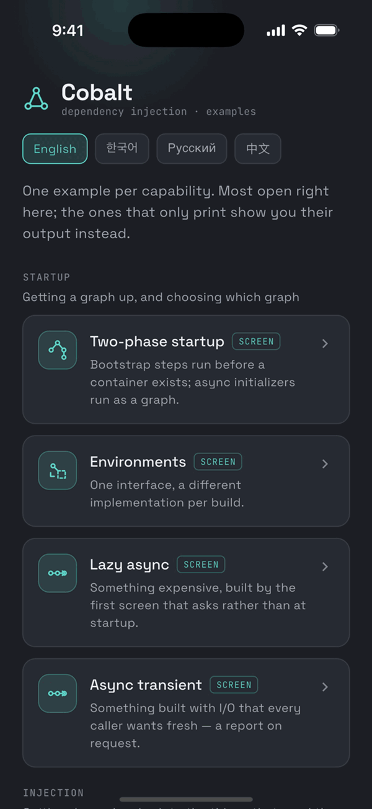

<p align="center">
  
</p>

<p align="center">
  <a href="https://pub.dev/packages/cobalt"></a>
  <a href="https://pub.dev/packages/cobalt/score"></a>
  <a href="https://pub.dev/packages/cobalt"></a>
  <a href="https://github.com/rutikeyone/cobalt/actions/workflows/ci.yml"></a>
  <a href="LICENSE"></a>
</p>

<p align="center">
  <a href="README.md">English</a> · <a href="README.ru.md">Русский</a> · <a href="README.zh-CN.md">中文</a> · <a href="README.ko.md">한국어</a>
</p>

> 本文档译自 [README.md](README.md)。英文版为准：若有出入，以英文为准。
> 各个包自身的 README 不作翻译——它们是 API 参考。

# Cobalt

面向 Flutter 和 Dart 的依赖注入。对象住在作用域里——整个应用、一次登录会话、一个结账流程、一个屏幕——作用域结束时，在其中构建的一切都随之关闭。

<p align="center">
  
</p>

<p align="center"><sub>gallery：打开一个会话作用域，再在 <code>cobalt_inspector</code> 里看实时作用域树。</sub></p>

## 快速开始

在一个 Flutter 应用里（用 `flutter create my_app` 创建）添加依赖：

```bash
flutter pub add cobalt cobalt_flutter dev:cobalt_generator dev:build_runner
```

`cobalt` 要单独添加：它是运行时，生成的代码会直接导入它。

替换 `lib/main.dart`：

```dart
import 'package:cobalt_flutter/cobalt_flutter.dart';
import 'package:flutter/material.dart';

import 'cobalt.g.dart';

@cobaltInject
class Clock {
  Clock();

  DateTime now() => DateTime.now();
}

@cobaltInject
class Greeter {
  Greeter(this.clock);

  final Clock clock;

  String greet(String name) =>
      clock.now().hour < 12 ? 'Good morning, $name!' : 'Hello, $name!';
}

void main() => runApp(
  MaterialApp(
    builder: CobaltAppScope.builder(root: const $CobaltRootScope()),
    home: const HomeScreen(),
  ),
);

class HomeScreen extends StatelessWidget {
  const HomeScreen({super.key});

  @override
  Widget build(BuildContext context) {
    final greeter = context.cobalt<Greeter>();
    return Scaffold(body: Center(child: Text(greeter.greet('Cobalt'))));
  }
}
```

同时删除 `test/widget_test.dart`：它测试的是 `flutter create` 生成的计数器应用，而那个应用已经不在了。

生成连接代码并运行：

```bash
dart run build_runner build
flutter run
```

构建运行之前，编辑器会把 `cobalt.g.dart` 和 `$CobaltRootScope` 标为不存在。这是正常的：它们由构建生成。如果还有别的地方报红，请看[第一次构建](docs/TROUBLESHOOTING.zh-CN.md#第一次构建)。

`@cobaltInject` 注册一个类。`Greeter` 在构造函数里要一个 `Clock`，生成器在 `lib/cobalt.g.dart` 里把两者连起来。`CobaltAppScope` 在应用启动时构建图，在应用退出时关闭它；`context.cobalt<Greeter>()` 从图中读取。同一个应用，外加一个替换时钟的测试，在 [`examples/hello`](examples/hello)。

## 下一步

三步，每一步都有可以运行的代码：

1. **整个应用一张图。** [`examples/hello`](examples/hello)：就是上面的代码，外加它的测试。
2. **你自己的作用域。** gallery 里的「会话作用域」条目（`cd examples/gallery && flutter run`）：登录时创建一个作用域，退出时把它连同其中构建的一切一起关闭。代码在 [`examples/notes_app/lib/features/session`](examples/notes_app/lib/features/session)。
3. **替换依赖的测试。** [`examples/testing_patterns`](examples/testing_patterns)。

旁支：[`examples/codegen_basics`](examples/codegen_basics) 展示生成器还能做什么（属性注入、装饰器、每个界面一个作用域）；[`examples/manual_mode`](examples/manual_mode) 和 [`examples/teardown`](examples/teardown) 展示单独使用运行时、纯 Dart 的写法。

## 为什么用 Cobalt

- **作用域结束时，会带走它的对象。** 作用域构成一棵树。退出登录就是 `await session.dispose()`：会话构建的一切都会被关闭，从新到旧。不需要 `reset()` 方法，也不需要监听退出事件。
- **错误在构建期暴露。** 没人注册的依赖会让 `build_runner` 失败，消息一次列出所有缺口。[十八条 lint 规则](packages/cobalt_lint/README.md)在编辑器里抓住其余问题。
- **生成的代码就是普通 Dart。** 它只用公开 API，所以你可以读它——也可以不用生成器，手写同样的东西。两种方式可以共存于一个图。
- **异步启动按正确顺序进行。** 必须在第一个屏幕之前等待的服务按依赖顺序启动，相互独立的并行启动。
- **测试替换的依赖对所有人生效。** override 在注册所在的地方替换它。没有全局容器，所以测试可以并行运行。
- **图是看得见的。** `cobalt_inspector` 在运行中的应用里展示实时作用域树和每一个事件。

<p align="center">
  
  
  
</p>

<p align="center"><sub>实时作用域树、拥有自己作用域的结账流程，以及图报告的一切——运行中应用里的 <code>cobalt_inspector</code>。</sub></p>

## 继续了解

| | |
|---|---|
| **一步一步，用生成器** | [GUIDE_CODEGEN.zh-CN.md](GUIDE_CODEGEN.zh-CN.md) |
| **一步一步，不用代码生成** | [GUIDE_MANUAL.zh-CN.md](GUIDE_MANUAL.zh-CN.md) |
| **从 get_it、injectable 或 provider 迁移** | [MIGRATION.zh-CN.md](MIGRATION.zh-CN.md) |
| **出错了** | [docs/TROUBLESHOOTING.zh-CN.md](docs/TROUBLESHOOTING.zh-CN.md)——每个错误，以及怎么处理 |
| **全部特性、工作原理、兼容性、性能** | [docs/OVERVIEW.zh-CN.md](docs/OVERVIEW.zh-CN.md) |
| **一个应用看全部特性** | `cd examples/gallery && flutter run` |
| **参与开发 Cobalt 本身** | [CONTRIBUTING.md](CONTRIBUTING.md)（英文） |

## 包

应用需要 `cobalt` 和 `cobalt_flutter`；使用代码生成时再加 `cobalt_generator` 和 `build_runner`。其余都是可选的。

<details>
<summary>全部十五个包</summary>

| 包 | 依赖 | 是否进入应用 |
|---|---|---|
| `cobalt_annotations` | `meta` | 是 |
| `cobalt` | `cobalt_annotations` | 是，运行时核心，不含 Flutter |
| `cobalt_flutter` | `cobalt`、`flutter` | 是 |
| `cobalt_go_router` | `cobalt_flutter`、`go_router` | 是，可选 |
| `cobalt_bloc` | `cobalt`、`bloc` | 是，可选 |
| `cobalt_talker` | `cobalt`、`talker` | 是，可选 |
| `cobalt_logging` | `cobalt`、`logging` | 是，可选 |
| `cobalt_logger` | `cobalt`、`logger` | 是，可选 |
| `cobalt_analyzer` | `cobalt_annotations`、`analyzer` | 否 |
| `cobalt_generator` | `cobalt_analyzer`、`build`、`source_gen`、`code_builder` | 仅 dev_dependency |
| `cobalt_lint` | `cobalt_analyzer`、`analysis_server_plugin` | 仅 dev_dependency |
| `cobalt_test` | `cobalt`、`test_api`、`matcher` | 仅 dev_dependency |
| `cobalt_test_flutter` | `cobalt_flutter`、`flutter_test` | 仅 dev_dependency |
| `cobalt_inspector` | `cobalt_flutter`、`flutter` | 仅 dev_dependency |
| `cobalt_talker_flutter` | `cobalt_inspector`、`cobalt_talker`、`talker_flutter` | 仅 dev_dependency |

</details>

## 环境要求

Dart 3.10 和 Flutter 3.38 或更新版本。你的项目会用到哪个 analyzer、为什么：[docs/OVERVIEW.zh-CN.md](docs/OVERVIEW.zh-CN.md#环境要求)。

## 许可证

MIT。见 [LICENSE](LICENSE)。
